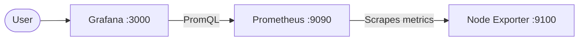

# Scenario 2

## Architecture



* **Node Exporter** collects CPU and memory metrics.
* **Prometheus** collects and stores these metrics.
* **Grafana** uses Prometheus as its data source and visualizes the metrics.

## Code

### Playbook & Role

The deployment is handled by `main.yml` and the `monitoring` role.

```text
roles/monitoring/
├── tasks/main.yml
└── handlers/main.yml
```

The role:

* Installs and configures Node Exporter.
* Installs and configures Prometheus.
* Installs Grafana.
* Configures Prometheus as the Grafana data source.
* Creates a CPU and Memory dashboard.
* Creates systemd services and starts all components.

### Inventory

The monitoring VM is defined in:

```text
inventory/inventory/monitoring.yml
```

```yaml
monitoring:
  hosts:
    mon-1:
      ansible_host: 95.38.235.89
      ansible_user: root
```

Ports are configured in `inventory/group_vars/monitoring.yml`:

```yaml
prometheus_port: 9090
grafana_port: 3000
node_exporter_port: 9100
```

## Deployment

```bash
python -m venv .venv
source .venv/bin/activate
pip install -r requirements.txt

ansible-playbook -i inventory main.yml -b \
  --private-key ~/.ssh/id_ed25519_fanap
```

## Services

```text
Grafana:       http://95.38.235.89:3000
Prometheus:    http://95.38.235.89:9090
Node Exporter: http://95.38.235.89:9100
```

## Credentials / Login

```text
# Grafana
user: admin
pass: admin
```

Dashboard:

```text
Node Exporter - CPU & Memory
```
